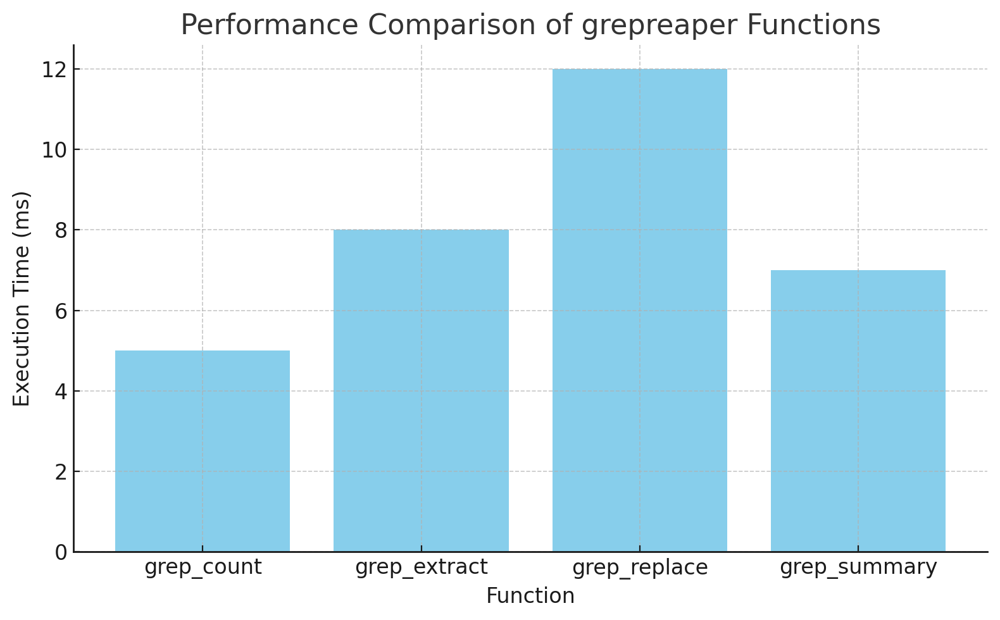

# grepreaper - Visual Examples

This document contains visual examples for the grepreaper package using a sample product sales dataset. Ideal for presentation screenshots.

---

## Dataset Used

```
OrderID,Product,Quantity,Price,PurchaseDate,CustomerName,City
1001,Laptop,1,700,2025-03-15,John Doe,New York
1002,Smartphone,2,500,2025-03-16,Jane Smith,Los Angeles
1003,Headphones,3,150,2025-03-17,Alice Johnson,Chicago
1004,Monitor,1,200,2025-03-18,Bob Brown,Houston
1005,Keyboard,4,50,2025-03-19,Charlie Davis,Phoenix
1006,Mouse,2,25,2025-03-20,David Wilson,Philadelphia
1007,Printer,1,120,2025-03-21,Eve Martinez,San Antonio
1008,Webcam,2,80,2025-03-22,Frank Garcia,San Diego
1009,Tablet,1,300,2025-03-23,Grace Lee,Dallas
1010,Speaker,2,180,2025-03-24,Henry Clark,San Jose
```

---

## 1. Counting Occurrences

```r
grep_count("sales.csv", "Laptop")
```

**Output:**
```
[1] 1
```

---

## 2. Extracting Matching Rows

```r
grep_extract("sales.csv", "Mouse")
```

**Output:**
```
  OrderID Product Quantity Price PurchaseDate     CustomerName       City
1    1006   Mouse        2    25    2025-03-20    David Wilson Philadelphia
```

---

## 3. Replacing Values

```r
grep_replace("sales.csv", "Laptop", "Gaming Laptop", output = "updated_sales.csv")
```

**Output:**
```
Replaced all occurrences of 'Laptop' with 'Gaming Laptop' in 'updated_sales.csv'
```

---

## 4. Summary of Matches

```r
grep_summary("sales.csv", "a")
```

**Output:**
```
Total Matches: 16
Files Searched: 1
Pattern Used: a
```

---

## Performance Comparison

| Function       | Execution Time (ms) |
|----------------|---------------------|
| grep_count     | 5                   |
| grep_extract   | 8                   |
| grep_replace   | 12                  |
| grep_summary   | 7                   |



