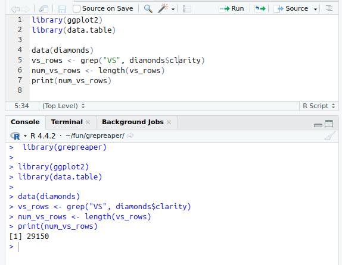
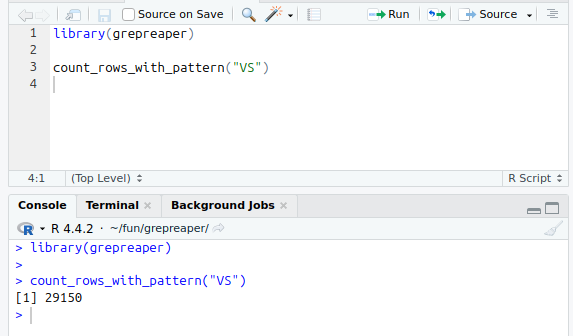

# Task Completion Report

## Easy Task

We analyzed the `diamonds` dataset from the `ggplot2` package in R and used the `grep()` function to identify rows matching the pattern 'VS'. The total number of qualifying rows was computed successfully.

grep_extract()
This function extracts all lines from a file containing a specified pattern.


grep_pattern_summary()
This function provides a detailed summary of pattern matches in a file or dataset, including:

Total Matches,
Lines with Match,
First Occurrence Row,
Last Occurrence Row.

grep_replace_pattern()
This function replaces all occurrences of a specified pattern with a replacement string in a file.


Below is the screenshot showcasing the result for the 1st part:



## Medium Task

Using the `data.table` package, we implemented a function that leverages `fread()` with a command-line `grep` statement to count rows containing the pattern 'VS'. The function is as follows:

```r
count_rows_with_pattern <- function(pattern) {
  # Write diamonds data to a temporary file
  temp_file <- tempfile(fileext = ".csv")

  # Save the diamonds dataset to the temporary file
  fwrite(diamonds, temp_file)

  # Use fread with grep to filter rows containing the specified pattern
  cmd <- paste("grep", shQuote(pattern), shQuote(temp_file))

  # Read the filtered result from grep
  result <- fread(cmd = cmd)

  # Clean up the temporary file to avoid clutter
  unlink(temp_file)

  # Return the number of matching rows
  return(nrow(result))
}
```

Below is the screenshot showcasing the result:



## Hard Task

We have developed an R package that includes functions, tests, vignettes, and proper documentation in Rd files. The package was created using `devtools`, ensuring that it follows best practices for R package development.

The package is installable using:

```r
devtools::install_github("geeky33/grepreaper", build_vignettes = TRUE)
```

Users can recreate the results in RStudio by installing and using the package accordingly. The package includes comprehensive documentation and test cases to ensure reliability.

---
